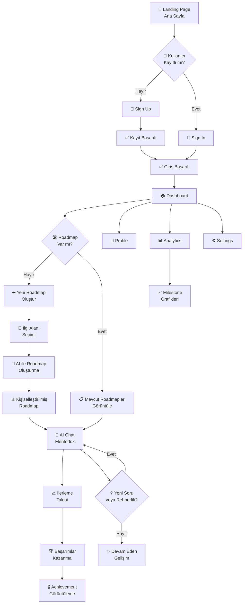

     

---

# 🏆 Takım İsmi

**Pathyvist**

---

## 🌐 Canlı Demo

> **🚀 Ürünün Test Videosunu İnceleyin!**  
> **[Live Demo - Pathyvo Platform](https://youtu.be/0DFEdhseVNE?si=zUVOEouuToJKJ8IT)**  
> _Pathyvo'yu denemek için yukarıdaki bağlantıya tıklayın ve AI tabanlı kariyer mentörünüzü keşfedin._

---

## 🧑‍🤝‍🧑 Takım Üyeleri

| İsim                    | Rol                                                 | Socials                                                                                                                                                          |
| ----------------------- | --------------------------------------------------- | ---------------------------------------------------------------------------------------------------------------------------------------------------------------- |
| _Mustafa Tamer AKDENİZ_ | Product Owner / AI-Prompt Engineer / Fullstack Dev. |                         |
| _Yusuf Cemal KARATAŞ_   | Backend Developer / DevOps                          |                  |
| _Öyküm İlayda DEMİR_    | Backend Developer                                   |         |
| _İkra Selma KENESARI_   | Scrum Master                                        |                            |
| _İrem KILIÇ_            | ---                                                 |  |

---

# 🚀 Ürün İsmi

**Pathyvo - AI Tabanlı Kişisel Kariyer Mentörü**

---

## 💡 Ürün Açıklaması

Pathyvo, öğrencilere ve kariyer değiştirmek isteyen bireylere kişiselleştirilmiş kariyer yolları sunan, AI tabanlı bir kariyer ve kişisel gelişim platformudur.  
Platform; kullanıcının notları, ilgi alanları ve hedeflerine göre özelleştirilmiş roadmap'ler oluşturur ve AI destekli sohbet özelliğiyle birebir mentorluk sağlar.

---

## ✨ Ürün Özellikleri

- Öğrencilerin veya profesyonellerin kendi yeteneklerini keşfetmesini sağlamak
- Kendi içsel potansiyellerine uygun roadmap'ler çıkarmak
- Adım adım izlenebilir kariyer planları sunmak
- Kişiye özel chatbot ile yolculuk boyunca destek olmak

---

## 🎯 Hedef Kitle

- Üniversite öğrencileri
- Yeni mezunlar
- Kariyerini değiştirmek veya yönlendirmek isteyen profesyoneller
- Kendi yol haritasını oluşturmak isteyen bireyler

---

## 🗺️ Product Backlog

🔗 **[Product Backlog (Miro Board)](https://miro.com/app/live-embed/uXjVIkGKydQ=/?embedMode=view_only_without_ui&moveToViewport=-3790%2C-427%2C7123%2C3550&embedId=848849262162)**

---

## 👨‍💻 Teknolojik Altyapı

| Katman                            | Teknoloji / Araç                             |
| --------------------------------- | -------------------------------------------- |
| **LLM**                           | Gemini API                                   |
| **Backend**                       | Python (Uvicorn) / FastAPI / Node.js         |
| **Frontend**                      | React (TypeScript & JSX & Lucide), TailwindCSS        |
| **Veritabanı**                    | SQLite                                       |
| **Analitik**                      | Python                                       |
| **Containerization & Deployment** | Docker, Docker Compose                       |

---

## 💼 Scrum Süreci ve Sprint Planlaması

Proje geliştirme süreci Scrum metodolojisine uygun şekilde 3 sprint olarak planlanmıştır.  
Proje backlog'u ve sprint planlaması **[Miro](https://miro.com/app/live-embed/uXjVIkGKydQ=/?embedMode=view_only_without_ui&moveToViewport=-3790%2C-427%2C7123%2C3550&embedId=848849262162)** üzerinden yönetilmektedir.

---

## 🗓 Sprint Bilgileri

### ✅ Toplam Story Point

- **Sprint 1:** 45 SP
- **Sprint 2:** 50 SP
- **Sprint 3:** 50 SP
- **Toplam:** 145 SP

---

<strong>⚡️ SPRINT 1 - MVP Kurulumu (45 SP)</strong>

### 🎯 Sprint Amacı

- Minimum Viable Product (MVP) altyapısını kurmak
- Temel kullanıcı akışını hazırlamak

### 🛠️ Ana Görevler

- Proje yapısının kurulumu (Frontend & Backend)
- Landing page tasarımı ve geliştirmesi
- Dashboard temel layout geliştirmesi
- LLM entegrasyonlarının temel API bağlantıları
- Temel kullanıcı kayıt ve oturum işlemleri
- Roadmap placeholder yapısı
- Chat sisteminin temel ekran tasarımı ve dummy veri entegrasyonu

### ✍🏻 Sprint Notları

- Sprint başlangıcında kapsam ve öncelikler netleştirildi.
- Backend ve frontend entegrasyonu için temel bağlantılar kuruldu.
- Kullanılan teknolojiler ve kullanım alanları:
  - **Python (FastAPI)**: Backend API geliştirmesi ve iş mantığı
  - **React (TypeScript)**: Kullanıcı arayüzü geliştirmesi
  - **TailwindCSS**: Hızlı ve esnek arayüz tasarımı
  - **SQLite**: Prototip veri saklama ve hızlı kurulum için hafif veritabanı
  - **JWT Token Authentication**: Kullanıcı kimlik doğrulama ve oturum yönetimi
- Proje yönetimi ve süreç takibi için **GitHub Projects** kullanılmasına karar verildi.
- Sprint planlama, roadmap ve task detaylandırma süreçlerinde **Miro** aktif şekilde kullanıldı.
- Planlanan işlerin büyük çoğunluğu başarıyla tamamlandı, bazı küçük görevler ikinci sprint’e devredildi.
- Ekip içi iletişim düzenli **Daily Scrum** toplantılarıyla (Google Meet) sürdürüldü, ayrıca anlık koordinasyon için WhatsApp grubu kullanıldı.

### 🎯 Sprint Tahmini Story Point

- Toplam: **45 SP**

### ✅ Sprint Tamamlama Mantığı

Sprint 1, planlanan 45 SP'nin %70'inden fazlası tamamlanarak başarıyla sonlandırılmıştır.  
Tamamlanamayan işler sonraki sprint'e taşınmış, bu sayede akışın sürekliliği korunmuştur.  
Tamamlama ölçütü; önceden belirlenen fonksiyonların çalışır ve test edilebilir olmasıdır.

### ✅ Çıktılar

- Çalışan ilk versiyon dashboard
- Bağlantılı dummy chat akışı
- Örnek roadmap görüntüleme

### 🤝🏻 Daily Scrum

Daily Scrum toplantıları Google Meet üzerinden yapılmaktadır.  
Günlük WhatsApp yazışmaları ve toplantı kayıtları [Google Drive](https://drive.google.com/drive/folders/1Owg14139fcCrq8VjDjp0u50jFioauFm0?usp=sharing)’da toplanmaktadır.

### 🖼️ Sprint Board Görselleri

   
  🔎 Sprint 1 planlama ve görevlerin board görünümü

---

   
  ✅ Sprint 1 tamamlandıktan sonraki son durum

### 🧐 Sprint Review

Sprint Review toplantısına Mustafa Tamer Akdeniz, Yusuf Cemal Karataş, Öyküm İlayda Demir, İkra Selma Kenesarı ve İrem Kılıç katılmıştır.  
Toplantıda, sprint çıktıları ve genel ilerleme değerlendirilmiştir. Güncel tasarım ve projenin gidişatı ekip ve paydaşlar tarafından beğenilmiş, mevcut yön üzerinde devam edilmesine karar verilmiştir.  
Tamamlanamayan görevler, öncelikli olarak 2. sprint’e devredilmiştir. Ayrıca, eklenmesi gereken yeni özellikler ve çıkarılması planlanan özellikler üzerine konuşulmuş ve bu konularda yeni task'lar tanımlanmıştır.

### 🔄 Sprint Retrospective

Sprint Retrospective oturumunda; ekip, tamamlanamayan görevlerin 2. sprint'te öncelikli olarak ele alınacağını belirtmiştir.  
Özellikle frontend geliştirmelerinin hızlandırılması ve backend entegrasyonu test edilebilirliğinin artırılması için çalışmaya hazır bir yapı oluşturulması kararlaştırılmıştır.  
Görev dağılımı konusunda herhangi bir değişikliğe gidilmemiş, mevcut dağılımın yeterli olduğu vurgulanmıştır.  
2. sprint için tasarım ve genel planlama konuşulmuş, motivasyon yüksek şekilde yeni sprint'e geçilmesine karar verilmiştir.

---

### 🚀 Ürüne Eklenen Özellikler (Sprint Sonu Ekran Görüntüleri)

  

  

  

  

  

  

  

  

---

<strong>⚡️ SPRINT 2 - Özellik Geliştirme & AI Entegrasyonu (50 SP)</strong>

### 🎯 Sprint Amacı

- AI tabanlı öneri ve roadmap akışını devreye almak
- Kullanıcı etkileşimini artıracak fonksiyonları aktif hale getirmek

### 🛠️ Ana Görevler

- AI chat bot geliştirmesi (frontend & backend)
- Roadmap oluşturma algoritması
- Kullanıcı bazlı roadmap detay ekranları
- Chat ekranında roadmap side panel entegrasyonu
- Kullanıcı kayıt ekranının backend'e bağlanması
- FastAPI endpoint sınırlandırması
- Konuşma geçmişinin veritabanına eklenmesi
- Test case’lerin hazırlanması
- Kullanıcı profiline özel test senaryoları
- LLM & Backend entegrasyonlarının tamamlanması
- Takım rolleri güncellemesi, aktif olmayan üyelerin belirlenmesi

### ✍🏻 Sprint Notları

- Sprint başlangıcında roadmap oluşturma ve chatbot modülleri önceliklendirildi.
- Chat ekranında roadmap side panel entegrasyonu başarıyla yapıldı.
- Kullanıcı kayıt ekranı backend’e başarıyla bağlandı.
- FastAPI endpoint’lerine erişim sınırlandırmaları getirildi.
- Konuşma geçmişi, kullanıcı bazlı olarak veritabanına eklendi.
- PyTest ile test senaryoları geliştirildi.
- LLM (Gemini API) & Backend entegrasyonu başarıyla tamamlandı.
- İlgi alanı güncelleme ekranı ve kurs/kaynak öneri API’si kapsam dışına alındı.
- Takım içinde rol güncellemeleri yapılarak aktif olmayan üyeler belirlendi.
- Proje yönetimi ve süreç takibi için GitHub Projects ve Miro aktif şekilde kullanılmaya devam etti.
- Günlük Scrum toplantıları Google Meet üzerinden devam etti, anlık iletişim için WhatsApp grubu kullanıldı.

### 🎯 Sprint Tahmini Story Point

- Toplam: **50 SP**

### ✅ Sprint Tamamlama Mantığı

Sprint 2, planlanan 50 SP’nin %90’ından fazlası başarıyla tamamlanarak sonlandırılmıştır.  
Tamamlanamayan işler (hata ve edge case yönetimi) bir sonraki sprint’e devredilmiştir.  
Tamamlama ölçütü; önceden belirlenen fonksiyonların çalışır ve test edilebilir olmasıdır.

### ✅ Çıktılar

- Roadmap oluşturma algoritması teknik altyapısı kuruldu
- Kullanıcı bazlı roadmap detay ekranları oluşturuldu
- Chat ekranına roadmap side panel entegrasyonu başarıyla yapıldı
- API çağrılarının tamamlanması ve testlerinin yazılması
- Backend fonksiyonları için kapsamlı test dosyaları hazırlandı

### 🤝🏻 Daily Scrum

Daily Scrum toplantıları **Google Meet** üzerinden yapılmaktadır.  
Günlük yazışmalar ve toplantı kayıtları [Google Drive](https://drive.google.com/drive/folders/13dtKtvmZWRzEGQWnk_iphIlVbCHLM7zB?usp=sharing) üzerinde saklanmaktadır.

### 🖼️ Sprint Board Görselleri

   
  🔎 Sprint-2 planlama ve görevlerin board görünümü

---

   
  ✅ Sprint-2 tamamlandıktan sonraki son durum

---

### 🧐 Sprint Review

Sprint Review toplantısına Mustafa Tamer Akdeniz, Yusuf Cemal Karataş, Öyküm İlayda Demir, İkra Selma Kenesarı katılmıştır.  
Toplantıda sprint çıktıları ve uygulamanın geldiği nokta değerlendirilmiştir.  
Tasarım, kullanıcı akışı ve teknik ilerleme ekip ve paydaşlar tarafından olumlu karşılanmıştır.  
Tamamlanamayan görevler üçüncü sprint’e taşınmış, ek ihtiyaçlara yönelik yeni task'lar tanımlanmıştır.

### 🔄 Sprint Retrospective

Sprint Retrospective oturumunda; test senaryoları, roadmap algoritması ve UI entegrasyonlarının ekip verimliliğine katkısı vurgulanmıştır.  
İletişim ve görev yönetimi konusunda olumlu geri bildirimler alınmıştır.  
Üçüncü sprint’te hata yönetimi, performans optimizasyonu ve kullanıcı deneyimini artıracak mikro animasyonlara odaklanılması planlanmıştır.  
Görev dağılımı büyük oranda korunmuş, motivasyon yüksek şekilde yeni sprint’e geçilmiştir.

---

### 🚀 Ürüne Eklenen Özellikler (Sprint Sonu Ekran Görüntüleri)

  
   
  
   
  
   
  💡 Bu görseller, sprint sonunda platforma entegre edilen yeni roadmap özelliklerini göstermektedir.

---

<strong>⚡️ SPRINT 3 - Yayına Hazırlık & Son Testler (50 SP)</strong>

### 🎯 Sprint Amacı

- Analytics ve Achievements ekranlarının geliştirilerek kullanıcıya veri odaklı geri bildirim sunulması
- LLM etkileşimi, prompt kontrolü ve roadmap yönetimi gibi temel işlevlerin son kullanıcı senaryolarıyla test edilmesi
- Uygulamanın performans, güvenlik ve hata yönetimi açısından optimize edilmesi
- Tüm platform bileşenlerinin entegre edilerek uygulamanın yayına hazır son haline getirilmesi

### 🛠️ Ana Görevler

- LLM servislerinin kontrolü ve prompt kalitesi iyileştirmesi
- Hata ve edge case senaryolarının yazılması
- Performans optimizasyonları
- Gelişmiş loglama ve analitik altyapısı
- Responsive ve mobil uyumluluk son kontrolleri
- Profile Page, Settings Page, View Achievements ve Analytics Page ekranlarının tamamlanması
- Analytics sayfası için milestone grafiklerinin entegrasyonu
- Test senaryolarının tamamlanması
- DevOps süreçleri ve projenin dockerize edilmesi
- Son kullanıcı testleri (UAT)
- Lansman öncesi kapsamlı hata avı

### ✍🏻 Sprint Notları

- LLM servisleri test edildi, prompt akışı optimize edilerek daha doğru yanıtlar alınması sağlandı.
- Sistem genelinde yaygın ve özel hata senaryoları oluşturuldu ve uygulamaya entegre edildi.
- Backend sorgularında optimizasyonlar yapılarak hız artışı sağlandı.
- Analytics modülünde milestone tabanlı grafik gösterimi aktif hale getirildi.
- Tüm sayfalar farklı cihazlarda responsive testlerden geçirildi.
- Kullanıcı profil sayfası, ayarlar ve başarı ekranları başarıyla oluşturuldu.
- PyTest altyapısı ile test senaryoları tüm modülleri kapsayacak şekilde genişletildi.
- Docker yapılandırması tamamlandı ve CI/CD süreci tanımlandı.
- UAT sürecinde alınan geri bildirimlere göre düzeltmeler uygulandı.
- Uygulama yayına hazır hale getirildi.

### 🎯 Sprint Tahmini Story Point

- Toplam: **50 SP**

### ✅ Sprint Tamamlama Mantığı

Sprint 3, planlanan görevlerin tamamı bitirilerek %100 başarıyla tamamlanmıştır.  
Sprint boyunca kullanıcı deneyimini doğrudan etkileyen son kontroller, testler ve LLM davranışı optimize edilmiştir.  
Uygulamanın ilk sürümü yayına hazır olacak şekilde teslim edilmiştir.

### ✅ Çıktılar

- LLM servisleri stabil hale getirildi ve prompt yönetimi geliştirildi
- Edge case & hata senaryoları oluşturulup test edildi
- Tüm backend ve frontend modülleri için performans iyileştirildi
- Analytics Page tamamlandı, milestone grafik yapısı eklendi
- Kullanıcı odaklı sayfalar: Profile, Settings, View Achievements hazırlandı
- Mobil uyumluluk ve responsive yapılar son kez kontrol edildi
- PyTest test dosyaları tüm sistem bileşenlerini kapsayacak şekilde tamamlandı
- Dockerfile ve deploy betikleri ile uygulama dockerize edildi
- UAT süreci yürütüldü, raporlanan sorunlar giderildi
- Yayın öncesi son hata avı süreci başarıyla tamamlandı

### 🤝🏻 Daily Scrum

Daily Scrum toplantıları **Google Meet** üzerinden yapılmaktadır.  
Günlük yazışmalar ve toplantı kayıtları [Google Drive](https://drive.google.com/drive/folders/1ydRLTnpVa4aC6fRHT6GeEhaVTEBKHOP6?usp=sharing) üzerinde saklanmaktadır.

### 🖼️ Sprint Board Görselleri

   
  🔎 Sprint-3 başlarken görev planlaması

---

   
  ✅ Sprint-3 tamamlandıktan sonraki görev durumu

---

### 🧐 Sprint Review

Sprint Review toplantısına Mustafa Tamer Akdeniz, Yusuf Cemal Karataş, Öyküm İlayda Demir, İkra Selma Kenesarı katılmıştır.  
Toplantıda sprint çıktıları detaylı şekilde değerlendirilmiş, özellikle LLM davranışı ve analitik modülün başarısı vurgulanmıştır.  
Uygulamanın kararlı bir şekilde yayına alınabileceği kanaatine varılmıştır.  
Yayın süreci için roadmap güncellenmiş ve planlar netleştirilmiştir.

### 🔄 Sprint Retrospective

Retrospective oturumunda; test süreçlerinin yoğunluğu, DevOps altyapısının kurulumu ve ekip koordinasyonunun başarıyla sağlanması vurgulanmıştır.  
Zamanlama ve iş bölümü açısından ideal bir sprint deneyimi yaşanmıştır.  
Ürünün son haline ulaşmasında bu sprintin belirleyici olduğu ifade edilmiştir.  
Ekipteki motivasyon yüksek kalmış, iş birliği güçlü şekilde korunmuştur.

---

### 🚀 Ürüne Eklenen Özellikler (Sprint Sonu Ekran Görüntüleri)

  
   
  
  
   
  
   
  
   
  🛠️ Bu görseller, sprint sonunda entegre edilen analiz, başarımlar, profil ve ayarlar bileşenlerini göstermektedir.

---

## 📚 Dokümantasyon

Projenin detaylı dokümantasyonu için aşağıdaki bağlantıları kullanabilirsiniz:

- **[Kurulum Rehberi](docs/installation.md)** - Projeyi yerel geliştirme ortamında kurma adımları
- **[Mimari Dokümantasyonu](docs/architecture.md)** - Sistem mimarisi, bileşenler ve teknik altyapı detayları
- **[API Dokümantasyonu](docs/api_documentation.md)** - Backend API endpoint'leri ve kullanım örnekleri
- **[Güvenlik Yönergeleri](docs/security_guidelines.md)** - Güvenlik best practice'leri ve öneriler
- **[Prompt Örnekleri](docs/prompt_examples.md)** - AI sisteminde kullanılan prompt şablonları ve örnekler
- **[Deployment Rehberi](docs/deployment.md)** - Geliştirme ve test ortamı deployment kılavuzu
- **[Prodüksiyon Deployment](docs/production_deployment.md)** - Prodüksiyon ortamı için deployment ve konfigürasyon

---

## 🔄 Uygulama Akış Şeması

Aşağıdaki akış şeması, Pathyvo platformundaki kullanıcı yolculuğunu ve sistem bileşenleri arasındaki etkileşimleri detaylı şekilde göstermektedir:

### 🎯 Ana Kullanıcı Akışı

1. **🚀 Giriş ve Kayıt**: Kullanıcılar landing page üzerinden platforma kayıt olur veya giriş yapar
2. **🏠 Dashboard**: Ana kontrol panelinde roadmap'ler, profil ve analitik erişimi sağlanır
3. **🛣️ Roadmap Oluşturma**: AI destekli kişiselleştirilmiş kariyer yol haritası oluşturma
4. **💬 AI Mentörlük**: Chatbot ile sürekli rehberlik ve destek alma
5. **📈 İlerleme Takibi**: Milestone'lar ve başarımlar ile gelişimi izleme
6. **📊 Analitik**: Detaylı performans analizi ve gelişim raporları

### 🔄 Sistem Etkileşim Akışı

Bu akış şeması, kullanıcının platformdaki tam yolculuğunu ve her adımda nasıl bir deneyim yaşayacağını göstermektedir.

---

### 🏠 Homepage

  
  
  
  
  

---

### 🔑 Sign Up

  

---

### 🔑 Sign In

  

---

### 📄 Dashboard

  

---

#### ➕ New Roadmap (Popup)

  
  
  

---

### 💬 Open Chat

  

---

### 📌 View Roadmap

  

---

### 🏆 View Achievements

  

---

### 📊 Analytics

  
  

---

### 🙍 Profile

  

---

### ⚙️ Settings

  

---

## 📄 Lisans

MIT License. Ayrıntılar için [LICENSE](LICENSE) dosyasına bakabilirsiniz.
