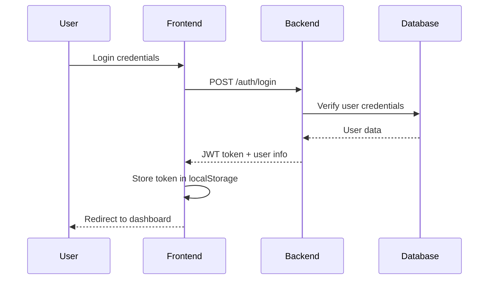
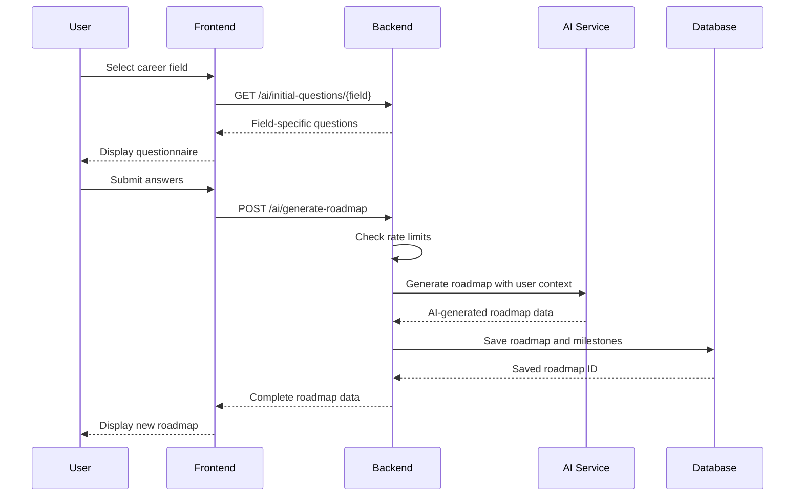
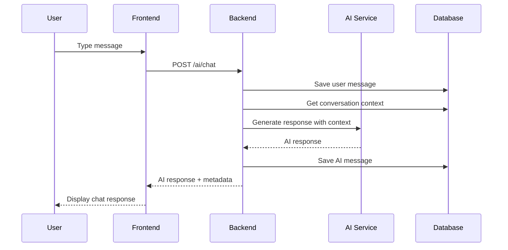

# System Architecture - Pathyvo Career Counselor

[](https://en.wikipedia.org/wiki/Microservices)
[](https://fastapi.tiangolo.com/)
[](https://reactjs.org/)

This document provides a comprehensive overview of the Pathyvo Career Counselor system architecture, detailing the design decisions, component interactions, data flow, and scalability considerations.

## 📋 Table of Contents

- [System Overview](#system-overview)
- [Architecture Patterns](#architecture-patterns)
- [Component Architecture](#component-architecture)
- [Data Flow](#data-flow)
- [Database Design](#database-design)
- [Security Architecture](#security-architecture)
- [AI Integration](#ai-integration)
- [Deployment Architecture](#deployment-architecture)
- [Scalability & Performance](#scalability--performance)
- [Technology Stack](#technology-stack)

## 🏗️ System Overview

Pathyvo is a full-stack web application designed to provide AI-powered career counseling and personalized learning roadmaps. The system follows a **client-server architecture** with clear separation of concerns between the frontend and backend.

### Core Objectives

- **Personalization**: AI-driven content tailored to individual users
- **Scalability**: Support for growing user base and feature expansion
- **Security**: Secure handling of user data and AI interactions
- **Performance**: Fast response times and efficient resource utilization
- **Maintainability**: Clean, modular code architecture

### High-Level Architecture

```
┌─────────────────┐    ┌─────────────────┐    ┌─────────────────┐
│   Frontend      │    │    Backend      │    │   External      │
│   (React SPA)   │◄──►│   (FastAPI)     │◄──►│   Services      │
│                 │    │                 │    │                 │
│ - User Interface│    │ - API Layer     │    │ - Gemini API    │
│ - State Mgmt    │    │ - Business Logic│    │ - OpenAI API    │
│ - Routing       │    │ - Data Access   │    │ - Anthropic API │
│ - Components    │    │ - Security      │    │ - Redis Cache   │
└─────────────────┘    └─────────────────┘    └─────────────────┘
         │                       │                       │
         └───────────────────────┼───────────────────────┘
                                 │
                    ┌─────────────────┐
                    │    Database     │
                    │   (SQLite/      │
                    │   PostgreSQL)   │
                    │                 │
                    │ - User Data     │
                    │ - Roadmaps      │
                    │ - Chat History  │
                    │ - Analytics     │
                    └─────────────────┘
```

## 🔧 Architecture Patterns

### 1. Layered Architecture

The backend follows a **layered architecture** pattern for clear separation of concerns:

```
┌─────────────────────────────────────────────────────┐
│                 API Layer                           │
│  - Route Handlers                                   │
│  - Request/Response Validation                      │
│  - HTTP Status Management                           │
└─────────────────────────────────────────────────────┘
┌─────────────────────────────────────────────────────┐
│               Business Logic Layer                  │
│  - LLM Service                                      │
│  - Achievement Service                              │
│  - Rate Limiting Service                            │
│  - Prompt Engineering Service                       │
└─────────────────────────────────────────────────────┘
┌─────────────────────────────────────────────────────┐
│                Data Access Layer                    │
│  - SQLAlchemy ORM Models                           │
│  - Database Sessions                                │
│  - Query Optimization                               │
└─────────────────────────────────────────────────────┘
┌─────────────────────────────────────────────────────┐
│                 Database Layer                      │
│  - SQLite (Development)                            │
│  - PostgreSQL (Production)                         │
│  - Connection Pooling                               │
└─────────────────────────────────────────────────────┘
```

### 2. Component-Based Architecture (Frontend)

The frontend uses React's **component-based architecture**:

```
App Component
├── Router (React Router)
├── Authentication Provider
├── Layout Components
│   ├── Header
│   ├── Navigation
│   └── Footer
├── Page Components
│   ├── Landing Page
│   ├── Dashboard
│   ├── Roadmap View
│   ├── Chat Interface
│   └── Analytics
└── Shared Components
    ├── Modals
    ├── Forms
    ├── Charts
    └── UI Elements
```

### 3. Service-Oriented Design

Business logic is encapsulated in service classes:

- **LLM Service**: AI model integration and management
- **Rate Limit Service**: Request rate limiting and quota management
- **Achievement Service**: Badge and reward system logic
- **Prompt Service**: AI prompt templates and context management

## 🧩 Component Architecture

### Backend Components

#### 1. API Layer (`app/api/`)

**Purpose**: Handle HTTP requests and responses

**Components**:
- `routes_auth.py`: Authentication and user management
- `routes_ai.py`: AI-powered features and rate-limited endpoints
- `routes_roadmap.py`: Roadmap CRUD and analytics
- `routes_chat.py`: Chat message management
- `routes_user.py`: User profile and settings
- `routes_achievement.py`: Achievement and badge system

**Responsibilities**:
- Request validation using Pydantic schemas
- Authentication and authorization checks
- HTTP status code management
- Error handling and response formatting

#### 2. Core Layer (`app/core/`)

**Purpose**: Core configuration and security utilities

**Components**:
- `config.py`: Application settings and environment management
- `security.py`: Security middleware and utilities

**Responsibilities**:
- Environment variable management
- Security headers and middleware
- JWT token configuration
- CORS and rate limiting setup

#### 3. Models Layer (`app/models/`)

**Purpose**: Database schema definition using SQLAlchemy ORM

**Components**:
- `user.py`: User model with profile information
- `roadmap.py`: Career roadmap model with progress tracking
- `milestone.py`: Individual learning milestone model
- `chat_message.py`: Chat conversation model
- `achievement.py`: Achievement and badge model

**Relationships**:
```sql
User 1:N Roadmap 1:N Milestone
User 1:N ChatMessage N:1 Roadmap
User 1:N Achievement
```

#### 4. Services Layer (`app/services/`)

**Purpose**: Business logic implementation

**Components**:
- `llm_service.py`: AI model integration and prompt management
- `rate_limit_service.py`: Request rate limiting logic
- `achievement_service.py`: Achievement calculation and awarding
- `prompt_service.py`: Prompt templates and context management
- `recommendation.py`: Content recommendation algorithms

#### 5. Schemas Layer (`app/schemas/`)

**Purpose**: Request/response validation using Pydantic

**Components**:
- Data validation models
- API request/response schemas
- Type safety and serialization

### Frontend Components

#### 1. Pages (`src/pages/`)

**Purpose**: Top-level route components

**Components**:
- `Landing.tsx`: Marketing and onboarding page
- `Dashboard.tsx`: User dashboard with roadmap overview
- `Roadmap.tsx`: Individual roadmap detail view
- `Chat.tsx`: AI chat interface
- `Analytics.tsx`: Progress tracking and statistics
- `Profile.tsx`: User profile management

#### 2. Layout Components (`src/components/`)

**Purpose**: Reusable UI components

**Categories**:
- **Navigation**: Header, sidebar, breadcrumbs
- **Forms**: Login, registration, roadmap creation
- **Data Display**: Charts, cards, tables
- **Modals**: Confirmations, forms, info displays
- **Feedback**: Toasts, loading states, error messages

#### 3. Utilities (`src/utils/`, `src/api/`)

**Purpose**: Helper functions and API integration

**Components**:
- `axiosInstance.ts`: HTTP client configuration
- `auth.ts`: Authentication utilities
- Type definitions and interfaces

## 🌊 Data Flow

### 1. User Authentication Flow



### 2. AI Roadmap Generation Flow



### 3. Chat Interaction Flow



## 🗄️ Database Design

### Entity Relationship Diagram

```
┌─────────────┐       ┌─────────────┐       ┌─────────────┐
│    User     │       │   Roadmap   │       │  Milestone  │
│─────────────│       │─────────────│       │─────────────│
│ id (PK)     │─────┐ │ id (PK)     │─────┐ │ id (PK)     │
│ name        │     └─│ user_id(FK) │     └─│ roadmap_id  │
│ email       │       │ title       │       │ title       │
│ password    │       │ description │       │ description │
│ avatar      │       │ field       │       │ completed   │
│ joined_at   │       │ progress    │       │ completed_at│
└─────────────┘       │ created_at  │       │ resources   │
                      └─────────────┘       └─────────────┘
                             │
                      ┌─────────────┐       ┌─────────────┐
                      │ ChatMessage │       │ Achievement │
                      │─────────────│       │─────────────│
                      │ id (PK)     │       │ id (PK)     │
                      │ roadmap_id  │       │ user_id(FK) │
                      │ user_id(FK) │       │ title       │
                      │ type        │       │ description │
                      │ content     │       │ type        │
                      │ timestamp   │       │ earned_at   │
                      └─────────────┘       └─────────────┘
```

### Database Schema Details

#### User Table
```sql
CREATE TABLE users (
    id SERIAL PRIMARY KEY,
    name VARCHAR(100) NOT NULL,
    email VARCHAR(255) UNIQUE NOT NULL,
    hashed_password TEXT NOT NULL,
    avatar_url TEXT,
    joined_at TIMESTAMP DEFAULT CURRENT_TIMESTAMP
);
```

#### Roadmap Table
```sql
CREATE TABLE roadmaps (
    id SERIAL PRIMARY KEY,
    user_id INTEGER REFERENCES users(id) ON DELETE CASCADE,
    title VARCHAR(255) NOT NULL,
    description TEXT,
    field VARCHAR(100) NOT NULL,
    progress INTEGER DEFAULT 0,
    next_milestone VARCHAR(255),
    total_milestones INTEGER DEFAULT 0,
    completed_milestones INTEGER DEFAULT 0,
    estimated_time_to_complete VARCHAR(50),
    created_at TIMESTAMP DEFAULT CURRENT_TIMESTAMP
);
```

#### Milestone Table
```sql
CREATE TABLE milestones (
    id SERIAL PRIMARY KEY,
    roadmap_id INTEGER REFERENCES roadmaps(id) ON DELETE CASCADE,
    title VARCHAR(255) NOT NULL,
    description TEXT,
    completed BOOLEAN DEFAULT FALSE,
    completed_at TIMESTAMP,
    due_date DATE,
    resources JSON
);
```

### Data Optimization Strategies

1. **Indexing**: Primary keys, foreign keys, and frequently queried fields
2. **Connection Pooling**: Efficient database connection management
3. **Query Optimization**: Selective loading and JOIN optimization
4. **Caching**: Redis for frequently accessed data (production)

## 🔒 Security Architecture

### Authentication & Authorization

#### JWT Token Flow
```
┌─────────────┐    ┌─────────────┐    ┌─────────────┐
│   Client    │    │   Backend   │    │  Database   │
│             │    │             │    │             │
│ 1. Login    │───►│ 2. Verify   │───►│ 3. User     │
│    Request  │    │    Creds    │    │    Lookup   │
│             │    │             │    │             │
│ 5. Store    │◄───│ 4. Generate │◄───│             │
│    Token    │    │    JWT      │    │             │
│             │    │             │    │             │
│ 6. Use Token│───►│ 7. Validate │    │             │
│    in Headers│   │    Token    │    │             │
└─────────────┘    └─────────────┘    └─────────────┘
```

#### Security Layers

1. **Transport Security**: HTTPS encryption
2. **Authentication**: JWT tokens with expiration
3. **Authorization**: Role-based access control
4. **Input Validation**: Pydantic schemas and sanitization
5. **Rate Limiting**: Per-user request quotas
6. **Security Headers**: CORS, CSP, and security headers

### Data Protection

- **Password Hashing**: bcrypt with salt
- **Data Encryption**: Database encryption at rest
- **Secure Communication**: TLS 1.2+ for all API calls
- **Input Sanitization**: XSS and injection prevention

## 🤖 AI Integration

### LLM Service Architecture

```
┌─────────────────┐    ┌─────────────────┐    ┌─────────────────┐
│   Frontend      │    │    Backend      │    │   AI Providers  │
│                 │    │                 │    │                 │
│ User Input      │───►│ LLM Service     │───►│ 1. Gemini API   │
│ (Questions,     │    │                 │    │ 2. OpenAI API   │
│  Chat Messages) │    │ - Rate Limiting │    │ 3. Anthropic    │
│                 │    │ - Context Mgmt  │    │                 │
│ AI Response     │◄───│ - Error Handling│◄───│ Provider        │
│ (Roadmaps,      │    │ - Fallback Logic│    │ Selection &     │
│  Chat Replies)  │    │                 │    │ Fallback        │
└─────────────────┘    └─────────────────┘    └─────────────────┘
```

### AI Provider Strategy

1. **Primary Provider**: Google Gemini (gemini-2.0-flash)
2. **Fallback Providers**: OpenAI GPT-3.5/4, Anthropic Claude
3. **Load Balancing**: Automatic provider switching on failure
4. **Cost Optimization**: Token usage tracking and optimization

### Prompt Engineering

- **Template System**: Reusable prompt templates per use case
- **Context Management**: Conversation history and user profile context
- **Safety Filters**: Content moderation and appropriate responses
- **Quality Assurance**: Response validation and fallback handling

## 🚀 Deployment Architecture

### Development Environment

```
┌─────────────────┐
│  Local Machine  │
│                 │
│ ┌─────────────┐ │    ┌─────────────┐
│ │  Frontend   │ │    │   Backend   │
│ │ (Vite Dev)  │ │    │ (uvicorn)   │
│ │ Port 5173   │ │    │ Port 8000   │
│ └─────────────┘ │    └─────────────┘
│                 │           │
│ ┌─────────────┐ │    ┌─────────────┐
│ │  Database   │ │    │  AI APIs    │
│ │ (SQLite)    │ │    │ (External)  │
│ └─────────────┘ │    └─────────────┘
└─────────────────┘
```

### Production Environment

```
┌─────────────────────────────────────────────────────┐
│                Load Balancer                        │
│                   (Nginx)                          │
└─────────────────┬───────────────────────────────────┘
                  │
        ┌─────────┴─────────┐
        │                   │
┌───────▼────────┐  ┌──────▼────────┐
│   Frontend     │  │   Backend     │
│   (Static)     │  │   (Gunicorn/  │
│   Nginx Serve  │  │   Uvicorn)    │
└────────────────┘  └───────────────┘
                            │
                    ┌───────▼────────┐
                    │   Database     │
                    │ (PostgreSQL)   │
                    └────────────────┘
```

### Container Architecture (Docker)

```yaml
services:
  frontend:
    build: ./frontend
    ports: ["80:80"]
    
  backend:
    build: ./backend
    ports: ["8000:8000"]
    depends_on: [database]
    
  database:
    image: postgres:13
    volumes: [postgres_data:/var/lib/postgresql/data]
    
  redis:
    image: redis:alpine
    command: redis-server --appendonly yes
```

## ⚡ Scalability & Performance

### Horizontal Scaling Strategies

1. **Frontend Scaling**
   - CDN distribution for static assets
   - Multiple server instances behind load balancer
   - Client-side caching and lazy loading

2. **Backend Scaling**
   - Multiple API server instances
   - Database connection pooling
   - Async request handling with FastAPI

3. **Database Scaling**
   - Read replicas for analytics queries
   - Connection pooling
   - Query optimization and indexing

### Performance Optimizations

#### Frontend Optimizations
- **Code Splitting**: Lazy loading of routes and components
- **Bundle Optimization**: Tree shaking and minification
- **Image Optimization**: WebP format and lazy loading
- **Caching**: Service worker for offline functionality

#### Backend Optimizations
- **Async Operations**: Non-blocking I/O operations
- **Database Optimization**: Efficient queries and indexing
- **Response Caching**: Redis caching for static data
- **API Optimization**: Pagination and selective field loading

### Monitoring & Observability

1. **Application Metrics**
   - Request/response times
   - Error rates and types
   - User activity patterns

2. **Infrastructure Metrics**
   - Server resource utilization
   - Database performance
   - Network latency

3. **Business Metrics**
   - User engagement
   - Feature adoption
   - AI service usage

## 🛠️ Technology Stack

### Frontend Stack

| Layer | Technology | Purpose |
|-------|------------|---------|
| **Framework** | React 18 | Component-based UI development |
| **Language** | TypeScript | Type safety and developer experience |
| **Build Tool** | Vite | Fast development and optimized builds |
| **Styling** | TailwindCSS | Utility-first CSS framework |
| **HTTP Client** | Axios | API communication with interceptors |
| **Routing** | React Router | Client-side routing |
| **Charts** | Chart.js + react-chartjs-2 | Data visualization |
| **Icons** | Lucide React | Consistent icon library |

### Backend Stack

| Layer | Technology | Purpose |
|-------|------------|---------|
| **Framework** | FastAPI | High-performance async API framework |
| **Language** | Python 3.8+ | Backend development |
| **ORM** | SQLAlchemy | Database abstraction and migrations |
| **Validation** | Pydantic | Request/response validation |
| **Authentication** | JWT + bcrypt | Secure user authentication |
| **AI Integration** | Multiple providers | LLM service integration |
| **Database** | SQLite/PostgreSQL | Data persistence |
| **Caching** | Redis (optional) | Performance optimization |

### Development & Deployment

| Category | Technology | Purpose |
|----------|------------|---------|
| **Version Control** | Git | Source code management |
| **Containerization** | Docker | Application packaging |
| **Orchestration** | Docker Compose | Multi-service development |
| **Web Server** | Nginx | Static file serving and reverse proxy |
| **Process Manager** | Gunicorn/Uvicorn | Python WSGI/ASGI server |
| **SSL/TLS** | Let's Encrypt | HTTPS encryption |

## 🔄 Data Flow Patterns

### Request-Response Pattern

```
User Action → Frontend → API Call → Backend → Database → Response → Frontend → UI Update
```

### Event-Driven Pattern

```
Milestone Completion → Achievement Check → Badge Award → Notification → UI Update
```

### AI Integration Pattern

```
User Query → Context Building → AI Service → Response Processing → Database Storage → User Response
```

## 📈 Future Architecture Considerations

### Microservices Evolution

As the system grows, consider breaking into microservices:

1. **User Service**: Authentication and profile management
2. **Roadmap Service**: Career path generation and tracking
3. **AI Service**: LLM integration and prompt management
4. **Analytics Service**: Data analysis and reporting
5. **Notification Service**: User notifications and communications

### Scalability Improvements

1. **Message Queues**: For asynchronous processing
2. **Event Sourcing**: For audit trails and state reconstruction
3. **CQRS**: Separate read/write models for optimization
4. **API Gateway**: Centralized API management and routing

### Technology Upgrades

1. **Real-time Features**: WebSocket integration for live chat
2. **Mobile Support**: React Native or PWA enhancements
3. **Advanced AI**: Fine-tuned models and vector databases
4. **Edge Computing**: CDN and edge function deployment

This architecture document serves as a living guide for the Pathyvo Career Counselor system. It should be updated as the system evolves and new requirements emerge.
